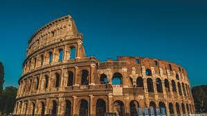

# Хочу съездить в Италию

## Посетить Рим
Как известно, Рим - столица Италии. Город с многовековой историей, переживший многие культурные и исторические эпохи. Хочется почувствовать себя частью огромного древнего города и посмотреть, насколько ветра времени изменили его.

---
## Увидеть местные достопримечательности
Рим славится своими памятниками древней архитектуры. И, пожалуй самым известным из них является Коллизей.

    Коллизей
В коллизее раньше устраивали гладиаторские бои. Как жаль, что в современной Италии такое уголовно наказуемо((

---
## Покушать __*настоящей*__ итальянской пиццы
В этом разделе я просто покажу, как должна выглядеть настоящая итальянская пицца (по моему субъективному мнению)

    Выглядит аппетитно, правда?

---
## Шоппинг в Милане